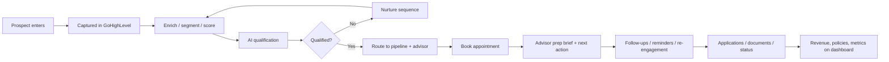
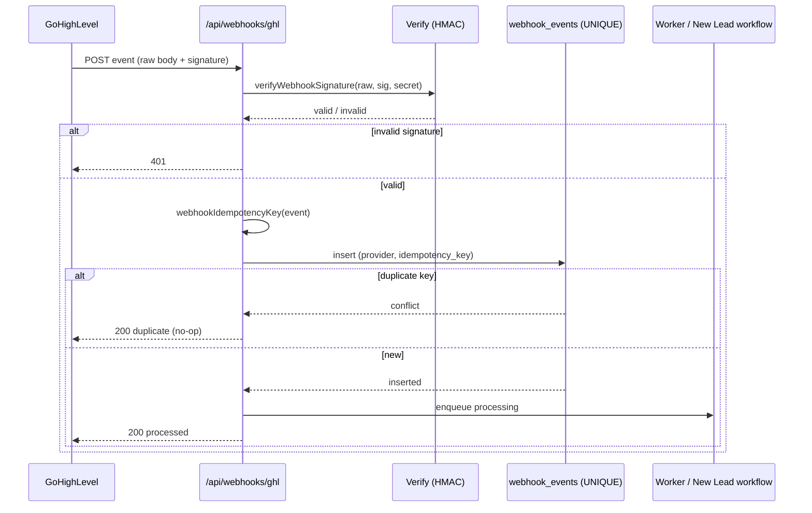
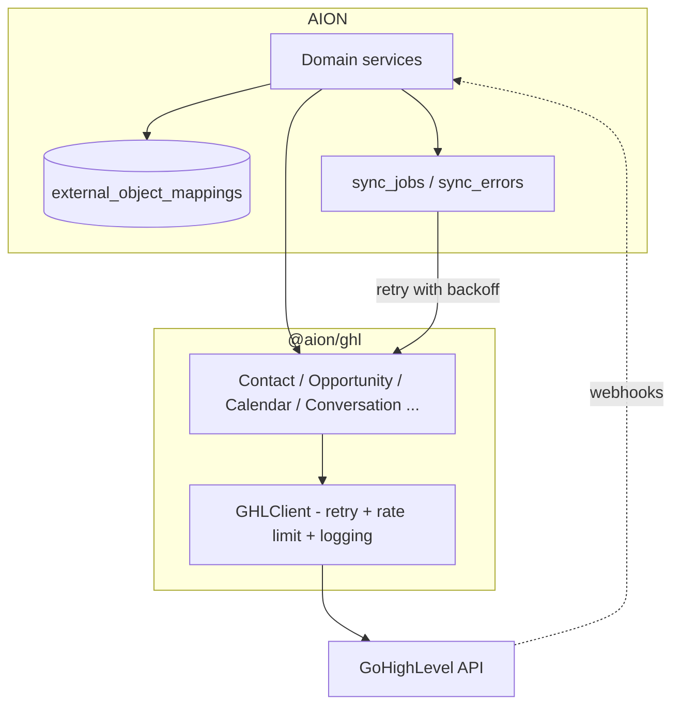
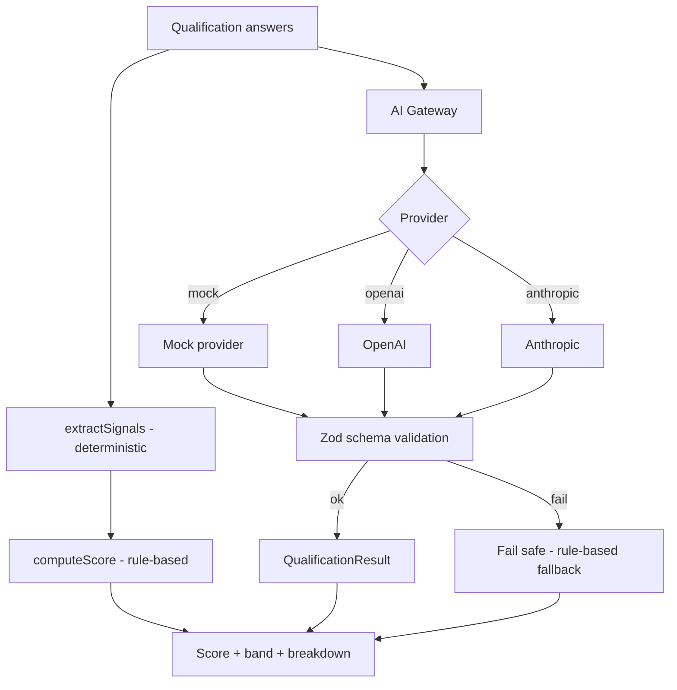
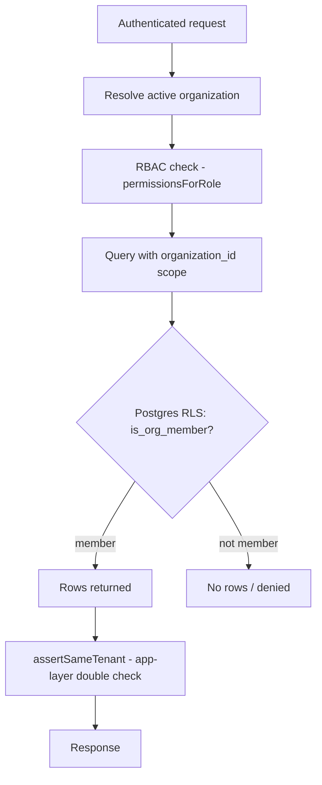
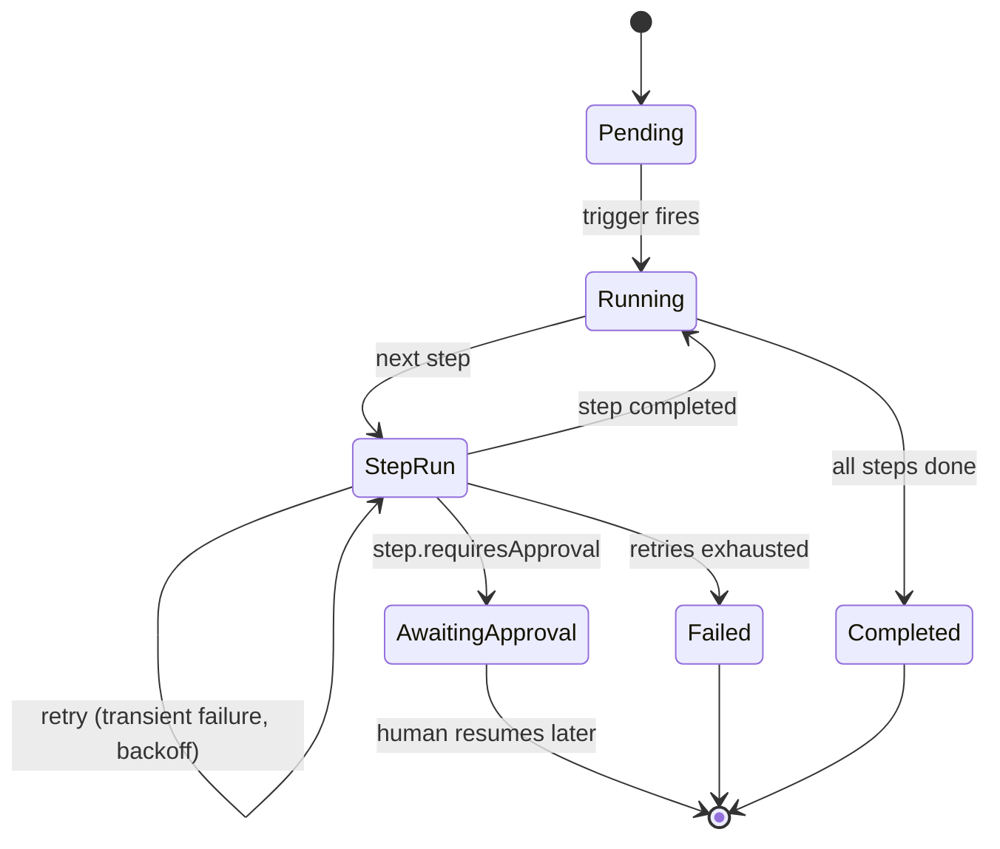
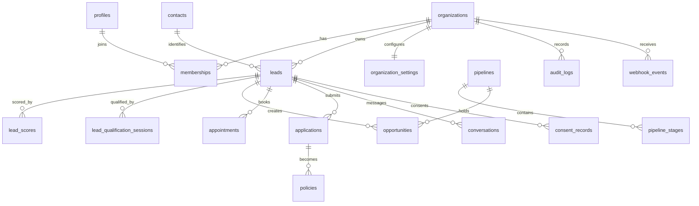

# Architecture

AION is a modular intelligence and experience layer on top of GoHighLevel. The
application layer owns AI qualification, scoring, workflows, analytics, and the
branded UI; GoHighLevel owns CRM records, communications, calendars, and its own
workflow execution. Everything is multi-tenant and designed for white-label
deployment.

## Design principles

- **GoHighLevel is the system of record for CRM data.** AION never couples UI or
  business logic to raw GHL calls — everything goes through `@aion/ghl`.
- **Provider-agnostic AI.** No component depends on a specific model vendor;
  everything flows through the `@aion/ai` gateway and Zod-validated schemas.
- **Deterministic where it matters.** Lead scoring is pure and reproducible so it
  is explainable and auditable; AI augments but never replaces it.
- **Tenant isolation is enforced in the database (RLS) and re-checked in the app.**
- **Fail safe.** AI output is never trusted without schema validation, and
  automation never triggers irreversible actions without workflow rules or human
  approval.

## 1. Overall system architecture

```mermaid
flowchart TB
    subgraph Client["Client experiences"]
      LP[Landing pages / forms / chatbot]
      WEB[Next.js dashboard - apps/web]
    end

    subgraph AppLayer["AION application layer"]
      API[API route handlers / apps/api]
      WORKER[Worker - workflow engine / apps/worker]
      subgraph Packages["Domain packages"]
        AI[@aion/ai]
        GHL[@aion/ghl]
        WF[@aion/workflows]
        AN[@aion/analytics]
        AUTH[@aion/auth]
        COMP[@aion/compliance]
        INT[@aion/integrations]
      end
    end

    subgraph Data["Data + platform"]
      DB[(Supabase Postgres + RLS)]
      STORE[(Supabase Storage / S3)]
    end

    subgraph External["External services"]
      GHLAPI[GoHighLevel API]
      LLM[AI providers - OpenAI / Anthropic]
      COMMS[Twilio / Telnyx / Email]
    end

    LP -->|webhook| API
    WEB --> API
    API --> Packages
    WORKER --> Packages
    API --> DB
    WORKER --> DB
    API --> STORE
    GHL --> GHLAPI
    AI --> LLM
    INT --> COMMS
    GHLAPI -->|webhooks| API
```

## 2. Lead journey



## 3. Webhook processing



## 4. GoHighLevel synchronization



## 5. AI qualification flow



## 6. Multi-tenant authorization



## 7. Workflow execution



## 8. Data model relationships (core)



See [`database-schema.md`](database-schema.md) for the full table listing.
